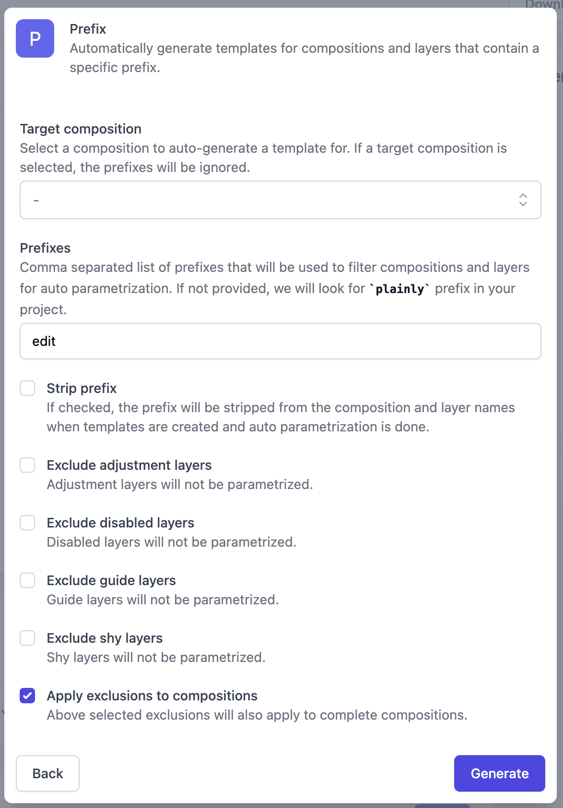

# MCP AI Crypto Video Agent

Generate a short crypto performance video by combining Free Crypto Coin Data and
Plainly MCP tools.

## Prerequisites

- [Node.js](https://nodejs.org/) 18+ (or newer)
- [pnpm](https://pnpm.io/) package manager
- Smithery API key (Free Crypto Coin Data)
- Plainly API key

## Getting started

1. Clone the repository:

    ```bash
    git clone https://github.com/plainly-videos/examples.git
    cd examples/mcp-ai-crypto-video-agent
    ```

2. Install dependencies:
   - `pnpm install --frozen-lockfile`
3. Upload the After Effects project used in this example to Plainly:
    - Download the example project from [here](./after-effects/Crypto%202025.zip).
    - Go to [Upload form](https://app.plainlyvideos.com/dashboard/projects/create) and upload the project.
    - Once the upload is done, auto-generate a template with prefix option:
       - Set the prefixes to `edit`, which will include all compositions starting with `edit` and their parameters.
        - Click on "Generate".
        - This will generate a template with few parameters from layers.

    <p align="center">
      
    </p>

4. Set up environment variables:
   
   ```bash
    cp .env.example .env.local
    ```

    Update `.env.local` with your Smithery API from [Smithery account settings](https://smithery.ai/account/api-keys) key and Plainly API key from [Plainly settings](https://app.plainlyvideos.com/dashboard/user/settings/general).

    ```properties
    # Smithery API Key
    SMITHERY_API_KEY=your_smithery_api_key

    # Plainly API Key
    PLAINLY_API_KEY=your_plainly_api_key
    ```

## Usage

- Default coin (bitcoin):
  - `pnpm start`
- Specify a coin:
  - `pnpm start -- --coin ethereum`

For this example, only `bitcoin` and `ethereum` are supported because the
template uses a static logo mapping for `editImage`.

## How it works

- Fetches current price plus 24h/7d change for the coin.
- Finds the Plainly project named "Crypto 2025".
- Uses the first template variant and maps data into parameters.
- Submits a render and polls until completion.

## Template parameters

The example maps these fields for the "Crypto 2025" template:

- `editName`
- `editSymbol`
- `editPrice`
- `editChange24h`
- `editChange7d`
- `editImage`
- `editDate`

If your template uses different parameter names, update the mapping in
`src/index.ts`.

## Scripts

- `pnpm start` - run the agent
- `pnpm build` - typecheck with TypeScript
- `pnpm biome` - lint and format check
- `pnpm biome:fix` - auto-fix lint issues
